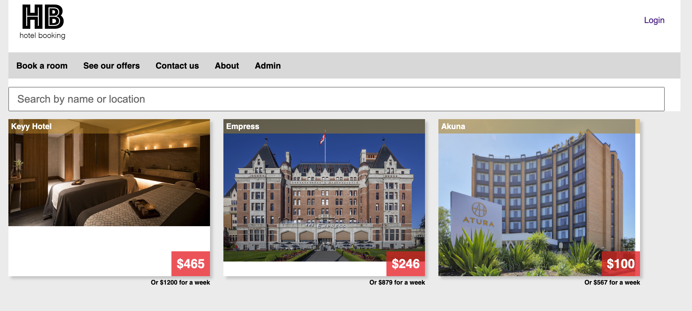
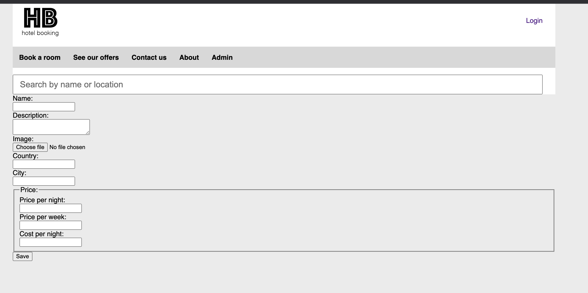

# HotelBookingz
Grégoire Duché - gregoire.duche@gmail.com

### What is this?
On June 3rd, I started this little example project to see how far I could go in implementing a new tool using React, Typescript and Node.js
The idea was to spend about 10 hours, creating an API to store and deliver users and hotels, and a front end app based on react.

There are 2 applications in this repository that are functionning to their minimum requirements.

### API
The api is based on Node.js and express. It also requires mongodb, which I have decided to installed using docker
To fully set up the API, you will need to:

run `npm install` in this root folder
run `docker-compose up -d --build mongo`
run `node api/src/index.js`

The API will then run on the port 9000.
It is pre-configured with one user via the mono-init.js script - the user name is sadmin and `password` `hotelbookingz`

#### Auth explained
I have implemented a very basic authentication mechanism to prevent admin routes to be accessed if you are not logged in
Basically, you will POST your credentials to http://localhost:9000/auth/login, and get a token in return. This token is to be added to every request you are submitting to the system to gain access to protected routes.
Routes that are in the `publicRoutes` variable in index.js can be access by anyone

#### Routes:
POST /auth/login - public, get a new user token when credentials are valid
GET /hotels - public - lists all hotels, ordered by revenue margin 
POST /hotels - restricted - create a new hotel in the system

### Web App
The web application is a React application using Typescript, and running with webpack
To set up the webapp, you will need to:

run `npm install` in the `web/` folder
run `npm run build` to build the assets
run `npm run start` to start the webapp on port 8080 

## Available pages
Pages that are fully functional are:
- home page : lists all the hotels you have created
- login: allows you to login and access the admin page
- admin: simple form to create a hotel

Much is to be done to secure & finish the admin side. I have implemented only to make sure that I could add test data from the webapp

## Restricted pages
The admin page is restricted to the admin. If you try to access the admin page, the application will automatically redirect you to the login page until  you have logged in.
Once logged in, your user token is stored in the application state and you can now access the page.

# Unit Tests
The focus was not to write unit tests for this exerise so do not look for them... for now. 

# Homepage

Hotels are fetched from the public API, and they are ordered by the difference between price per night and margin. This is done using an aggregate query in Mongo.
Images are currently stored as encoded data in the database, but this should be optimised.

# Admin

The admin side is very basic, and lacks validation and error handling. However, it will allow you to post the correct data to the database if you have the correct Auth token.
This page is only accessible if you have logged in before.

#TIME SPENT since June 3rd:
10:29:29
